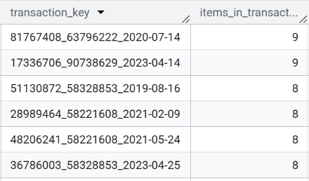

# Pet Store Sales Analysis (BigQuery SQL)
> This project demonstrates a complete data analysis workflow using Google BigQuery, starting from raw transactional data to Exploratory Data Analysis (EDA). The goal of this project is to clean, validate, and analyze sales data to generate useful business insights.

## Project Overview
In this project, I use a dummy dataset from a pet store containing 3 tables:
1. Sales
2. Customers
3. Products

The analysis includes:
- Data cleaning and validation
- Handling missing values
- Detecting duplicate transactions
- Building a master analytical table
- Performing Exploratory Data Analysis (EDA)

**All queries were written using Google BigQuery SQL.**

## Tools
1. Google BigQuery - Data Storage and SQL Analysis
2. SQL (Standard SQL) - Data Cleaning and Analysis

## Steps
### Load Dataset into BigQuery
As mentioned above, the tables in this project are Sales, Customers, and Products. Detail column of each tables are:
1. Sales: transaction_id, transaction_date, customer_id, product_id, quantity, total_amount
2. Customers: customer_id, contact_name, vip_customer_flag
3. Products: product_id, product_name, category

### Data Validation

**Check Missing Values**
```sql
SELECT
COUNT(*) AS total_rows,
COUNTIF(customer_id IS NULL) AS missing_customer_id,
COUNTIF(transaction_type IS NULL) AS missing_transaction_type,
COUNTIF(transaction_id IS NULL) AS missing_transaction_id,
COUNTIF(transaction_date IS NULL) AS missing_transaction_date,
COUNTIF(product_id IS NULL) AS missing_product_id,
COUNTIF(quantity IS NULL) AS missing_quantity,
COUNTIF(total_amount IS NULL) AS missing_total_amount
FROM `pet_store.sales`;
```
 <br>
*There are 9615 missing values for Customer_id*<br>
<br>
<br>
**How much does the missing values represent the total row?**
```sql
SELECT
ROUND(
  (COUNT(*) - COUNT(customer_id))*100.0/COUNT(*),2
) AS missing_percentage
FROM `pet_store.sales`;
```
 <br>
*Approximately 4.43% of rows contained missing customer IDs*<br>
<br>
<br>
**Investigate the transaction type of the missing values**
```sql
SELECT
transaction_type,
COUNT(*) AS total,
COUNT(customer_id) AS with_customer,
COUNT(*) - COUNT(customer_id) AS missing_customer
FROM `pet_store.sales`
GROUP BY transaction_type;
```
 <br>
*The missing values only occur in retail transactions and likely represent walk-in customers who completed purchases without registering an account. As the proportion of missing values is relatively small, these rows were retained in the dataset*<br>
<br>
<br>
**Check duplicate values**
```sql
SELECT transaction_id, COUNT(*)
FROM `pet_store.sales`
GROUP BY transaction_id
HAVING COUNT(*) > 1;
```
<br>
*Several transaction IDs were found to be duplicated*<br>
<br>
<br>
**Check a sample of the duplicated transaction IDs**
```sql
SELECT *
FROM `pet_store.sales`
WHERE transaction_id = 15838236;
```
<br>
*During data validation, several transaction_id values were linked to multiple customers and transaction dates, indicating that the field is not globally unique and may represent multiple transactions*<br>
<br>
<br>

To resolve this issue, a new transaction key was created using a composite identifier combining transaction_id, customer_id, and transaction_date. This ensured accurate transaction counting and prevented aggregation errors in downstream analysis.
```sql
SELECT *,
CONCAT(
transaction_id,'_',
COALESCE(CAST(customer_id AS STRING),'guest'),'_',
transaction_date
) AS transaction_key
FROM `pet_store.sales`;
```
<br>

**validate uniqueness**
```sql
SELECT
COUNT(*) AS total_rows,
COUNT(DISTINCT transaction_key) AS unique_transaction_keys
FROM (
SELECT
CONCAT(
CAST(transaction_id AS STRING),'_',
COALESCE(CAST(customer_id AS STRING),'guest'),'_',
CAST(transaction_date AS STRING)
) AS transaction_key
FROM `pet_store.sales`
);
```
<br>
*There were only 124835 unique transaction_key out of 217107 total row*<br>

**Check wether this is product-level rows**
```sql
SELECT
transaction_key,
COUNT(*) AS items_in_transaction
FROM (
SELECT
CONCAT(
CAST(transaction_id AS STRING),'_',
COALESCE(CAST(customer_id AS STRING),'guest'),'_',
CAST(transaction_date AS STRING)
) AS transaction_key
FROM `pet_store.sales`
)
GROUP BY transaction_key
ORDER BY items_in_transaction DESC
LIMIT 10;
```
<br>
<small>*After creating a composite transaction_key, it was observed that the number of unique transaction keys was smaller than the total number of rows. This indicates that the dataset is structured at the line-item level, where a single transaction can contain multiple products. Therefore, the transaction_key represents a unique transaction, while each row represents an individual product purchased within that transaction*<small>

**Check is there any row that is completely duplicated**
```sql
SELECT
customer_id,
transaction_id,
product_id,
transaction_date,
quantity,
total_amount,
COUNT(*) AS duplicate_count
FROM `pet_store.sales`
GROUP BY
customer_id,
transaction_id,
product_id,
transaction_date,
quantity,
total_amount
HAVING COUNT(*) > 1;
```
<br>
