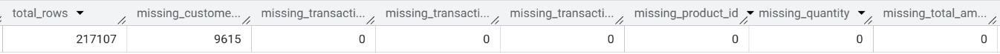
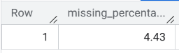
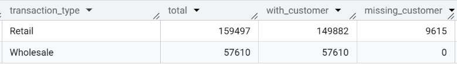
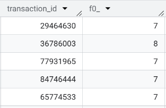
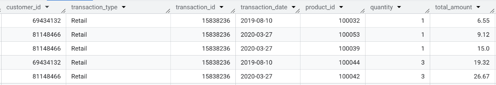
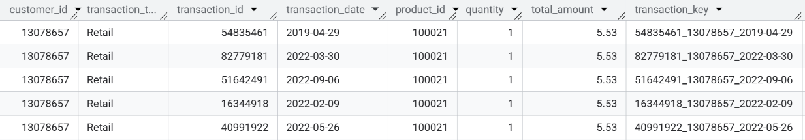
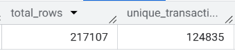

# 🐾 Pet Store Sales Analysis


A complete data analysis workflow using **Google BigQuery**, covering data cleaning, validation, table building, and Exploratory Data Analysis (EDA) — producing actionable business insights from a pet store's transactional data.

---

## 📌 Project Overview

This project works with a multi-table relational dataset representing a pet store's sales operations. The dataset contains **217,107 rows** across 3 tables and **21 unique products**, spanning transactions from 2019 to 2023.

| Table | Key Columns |
|-------|-------------|
| `Sales` | transaction_id, transaction_date, customer_id, product_id, quantity, total_amount |
| `Customers` | customer_id, contact_name, vip_customer_flag |
| `Products` | product_id, product_name, category_name |

---

## 🎯 Objectives

- Clean and validate raw transactional data
- Identify and resolve structural data quality issues
- Build a reliable master analytical table
- Perform EDA to surface business insights around product performance and transaction patterns

---

## 🛠️ Tools & Technologies

| Tool | Purpose |
|------|---------|
| Google BigQuery | Data storage and SQL-based analysis |
| Standard SQL | Data cleaning, transformation, and EDA |

---

## 🔍 Analysis Workflow

### Step 1 — Data Validation

#### Missing Values

Identified **9,615 missing `customer_id`** values — approximately **4.43%** of all rows.

```sql
SELECT
  COUNT(*) AS total_rows,
  COUNTIF(customer_id IS NULL) AS missing_customer_id,
  COUNTIF(transaction_type IS NULL) AS missing_transaction_type,
  COUNTIF(transaction_id IS NULL) AS missing_transaction_id,
  COUNTIF(transaction_date IS NULL) AS missing_transaction_date,
  COUNTIF(product_id IS NULL) AS missing_product_id,
  COUNTIF(quantity IS NULL) AS missing_quantity,
  COUNTIF(total_amount IS NULL) AS missing_total_amount
FROM `pet_store.sales`;
```



```sql
SELECT
  ROUND(
    (COUNT(*) - COUNT(customer_id)) * 100.0 / COUNT(*), 2
  ) AS missing_percentage
FROM `pet_store.sales`;
```



> **Finding:** Missing values are isolated to `retail` transactions, likely representing walk-in customers who did not register an account. Since the proportion is under 5%, these rows were **retained** in the dataset.

```sql
SELECT
  transaction_type,
  COUNT(*) AS total,
  COUNT(customer_id) AS with_customer,
  COUNT(*) - COUNT(customer_id) AS missing_customer
FROM `pet_store.sales`
GROUP BY transaction_type;
```



---

#### Duplicate Transactions

Initial checks showed that `transaction_id` is **not globally unique** — a single ID can be linked to multiple customers and dates.

```sql
SELECT transaction_id, COUNT(*)
FROM `pet_store.sales`
GROUP BY transaction_id
HAVING COUNT(*) > 1;
```



```sql
SELECT *
FROM `pet_store.sales`
WHERE transaction_id = 15838236;
```



> **Resolution:** Created a composite `transaction_key` by combining `transaction_id`, `customer_id`, and `transaction_date` to guarantee uniqueness across all rows.

```sql
SELECT *,
  CONCAT(
    CAST(transaction_id AS STRING), '_',
    COALESCE(CAST(customer_id AS STRING), 'guest'), '_',
    CAST(transaction_date AS STRING)
  ) AS transaction_key
FROM `pet_store.sales`;
```



Validated the composite key — only **124,835 unique keys out of 217,107 rows**, confirming the dataset is structured at the **line-item level** (one row per product per transaction).

```sql
SELECT
  COUNT(*) AS total_rows,
  COUNT(DISTINCT transaction_key) AS unique_transaction_keys
FROM (
  SELECT
    CONCAT(
      CAST(transaction_id AS STRING), '_',
      COALESCE(CAST(customer_id AS STRING), 'guest'), '_',
      CAST(transaction_date AS STRING)
    ) AS transaction_key
  FROM `pet_store.sales`
);
```



---

#### Additional Checks

| Check | Result |
|-------|--------|
| Completely duplicated rows | ✅ None found |
| Negative quantity / amount / product_id | ✅ None found |
| Unique products | 21 unique product IDs |

---

### Step 2 — Building the Master Table

All three tables were joined into a single `master_sales` table to simplify downstream analysis. Join integrity was verified to confirm no rows were lost.

```sql
-- Verify no failed product joins
SELECT *
FROM `pet_store.sales` sales
LEFT JOIN `pet_store.products` products
  ON sales.product_id = products.product_id
WHERE products.product_id IS NULL;
-- Result: 0 rows — all products matched
```

```sql
-- Verify unmatched customers are walk-in only
SELECT *
FROM `pet_store.sales` sales
LEFT JOIN `pet_store.customers` customers
  ON sales.customer_id = customers.customer_id
WHERE customers.customer_id IS NULL;
-- These represent walk-in (unregistered) customers
```

```sql
-- Create master table
CREATE OR REPLACE TABLE `pet_store.master_sales` AS
SELECT
  CONCAT(
    CAST(sales.transaction_id AS STRING), '_',
    COALESCE(CAST(sales.customer_id AS STRING), 'guest'), '_',
    CAST(sales.transaction_date AS STRING)
  ) AS transaction_key,
  sales.transaction_id,
  sales.transaction_date,
  sales.transaction_type,
  sales.customer_id,
  customers.contact_name,
  customers.vip_customer_flag,
  sales.product_id,
  products.product_name,
  products.category_name,
  sales.quantity,
  sales.total_amount
FROM `pet_store.sales` sales
LEFT JOIN `pet_store.customers` customers
  ON sales.customer_id = customers.customer_id
LEFT JOIN `pet_store.products` products
  ON sales.product_id = products.product_id;
```

---

### Step 3 — Exploratory Data Analysis (EDA)

Total revenue across all transactions: **$367,192,093.65**

```sql
SELECT SUM(total_amount) AS total_revenue
FROM `pet_store.master_sales`;
```

---

#### EDA Q1 — How did revenue trend year over year?

```sql
SELECT
  EXTRACT(YEAR FROM transaction_date) AS year,
  SUM(total_amount) AS revenue
FROM `pet_store.master_sales`
GROUP BY year
ORDER BY year;
```

| Year | Revenue |
|------|---------|
| 2019 | $2,522,095.65 |
| 2020 | $104,816,700.59 |
| 2021 | $104,472,840.24 |
| 2022 | $103,804,382.47 |
| 2023 | $51,576,074.70 |

> **Finding:** Revenue surged dramatically from 2019 to 2020, then remained stable through 2022 at ~$104M per year. The drop in 2023 is likely due to **partial-year data** rather than a true decline, as the figure is roughly half of a full year's revenue. 2019 also appears to be a partial year for the same reason.

---

#### EDA Q2 — Which product category drives the most revenue?

```sql
SELECT
  category_name,
  SUM(total_amount) AS revenue
FROM `pet_store.master_sales`
GROUP BY category_name
ORDER BY revenue DESC;
```

| Category | Revenue |
|----------|---------|
| Vaccine | $148,637,600.00 |
| Care | $120,038,670.05 |
| Supplement | $71,922,032.03 |
| Accessories | $26,593,791.57 |

> **Finding:** **Vaccine** is the top revenue-generating category at ~$148.6M, accounting for **40% of total revenue**, followed by **Care** at ~$120M. Together these two categories make up over **72% of total revenue**, making them critical to the store's financial health.

---

#### EDA Q3 — What are the top 10 best-selling products by units sold?

```sql
SELECT
  product_name,
  SUM(quantity) AS total_units_sold
FROM `pet_store.master_sales`
GROUP BY product_name
ORDER BY total_units_sold DESC
LIMIT 10;
```

| Rank | Product | Units Sold |
|------|---------|------------|
| 1 | Calm Cat Anxiety Relief Spray | 2,031,544 |
| 2 | Cat Hairball Remedy Gel | 1,964,001 |
| 3 | Advance Pet Oral Care Toothbrush and Toothpaste | 1,894,067 |
| 4 | Healthy Coat Cat Supplement | 1,748,861 |
| 5 | Healthy Coat Dog Supplement | 1,689,244 |
| 6 | Strong Joints Cat Supplement | 1,639,418 |
| 7 | Medicated Dog Shampoo | 1,601,268 |
| 8 | Probiotic Dog Treats | 1,566,484 |
| 9 | Large Hypoallergenic Pet Bowl | 1,563,108 |
| 10 | Senior Dog Vitamin Chews | 1,529,269 |

> **Finding:** **Cat-related products dominate the top sellers** — 4 of the top 6 products are cat-specific. The #1 product, *Calm Cat Anxiety Relief Spray*, outsold the #10 product by over 500,000 units, suggesting cats are the primary pet demographic in the store's customer base.

---

#### EDA Q4 — How do retail and wholesale transactions compare?

```sql
SELECT
  transaction_type,
  SUM(total_amount) AS revenue,
  COUNT(DISTINCT transaction_key) AS transactions
FROM `pet_store.master_sales`
GROUP BY transaction_type;
```

| Transaction Type | Revenue | Transactions | Avg. Transaction Value |
|-----------------|---------|--------------|----------------------|
| Wholesale | $356,162,429.40 | 33,026 | ~$10,784 |
| Retail | $11,029,664.25 | 91,809 | ~$120 |

> **Finding:** Despite retail having **2.8× more transactions** than wholesale, wholesale generates **97% of total revenue**. The average wholesale order value (~$10,784) is nearly 90× larger than the average retail transaction (~$120). This indicates the store is predominantly **B2B-driven**, even though most individual transactions come from retail walk-ins.

---

#### EDA Q5 — How does spending differ between VIP and non-VIP customers?

```sql
SELECT
  vip_customer_flag,
  SUM(total_amount) AS revenue,
  COUNT(DISTINCT customer_id) AS customers
FROM `pet_store.master_sales`
GROUP BY vip_customer_flag;
```

| Segment | Revenue | Customers | Avg. Revenue per Customer |
|---------|---------|-----------|--------------------------|
| VIP (flag = 1) | $277,487,347.51 | 44 | ~$6,306,530 |
| Non-VIP (flag = 0) | $89,161,700.54 | 109 | ~$818,181 |
| Walk-in (null) | $543,045.60 | — | — |

> **Finding:** Just **44 VIP customers** account for **75.6% of total revenue** ($277.5M), each spending on average ~$6.3M. Non-VIP customers average ~$818K each. This extreme revenue concentration means that **VIP retention is the single most critical business risk** — losing even a few of these accounts would have a major impact on revenue.

---

## 📊 Summary of Key Findings

| Insight | Detail |
|---------|--------|
| Total revenue (2019–2023) | $367,192,093.65 |
| Revenue peak years | 2020–2022 (~$104M/year) |
| Top revenue category | Vaccine (40% of total revenue) |
| Best-selling product | Calm Cat Anxiety Relief Spray (2M+ units) |
| Dominant sales channel | Wholesale (97% of revenue, 33K transactions) |
| VIP customer impact | 44 VIP customers = 75.6% of total revenue |
